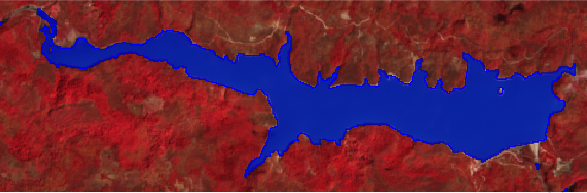

 

# EmbalsesHN

Primera prueba para la delimitación de los embalses de Honduras. La delimitación usa el [NDWI](https://en.wikipedia.org/wiki/Normalized_difference_water_index) y calcula el umbral del índice para separar agua de suelo o vegetación usando el algoritmo de [OTSU](https://en.wikipedia.org/wiki/Otsu%27s_method).

Todo esta escrito en R, el acceso a la colección de imágenes [Sentinel-2](https://sentinel.esa.int/web/sentinel/missions/sentinel-2) es usando [GEE](https://www.sciencedirect.com/science/article/pii/S0034425717302900) a través del increible paquete [RGEE](https://csaybar.github.io/rgee-examples/) de [Cesar Aybar](https://csaybar.github.io/), [Qiusheng Wu](https://geography.utk.edu/about-us/faculty/dr-qiusheng-wu/), [Lesly Bautista](https://orcid.org/0000-0003-3523-8687), [Roy Yali](https://ryali93.github.io/en/) y [Antony Barja](https://github.com/ambarja), el artículo que describe el paquete puede ser accesado [aquí](https://joss.theoj.org/papers/10.21105/joss.02272). 

\| [`El Cajón`](#el-cajón) \| [`La Concepción`](#la-concepción) \|
[`Nacaome`](#Nacaome) \| [`El Coyolar`](#el-coolar) \| [`Los Laureles`](#los-laureles)
\| [`Yure`](#Yure) \| [`Patuca III`](#patuca-iii) \| [`Cuadro Resumen`](#cuadro-resumen-de-embalses) \|
# El Cajón

## Junio 25 2021 composición B8/B4/B3 con delimitación superpuesta

# La Concepción

## Febrero 10 de 2021 composición B8/B4/B3 con delimitación superpuesta

# Nacaome

## Marzo 22 2021 composición B8/B4/B3 con delimitación superpuesta

# El Coyolar

## Febrero 10 2021 composición B8/B4/B3 con delimitación superpuesta

# Los Laureles

## Marzo 07 2021 composición B8/B4/B3 con delimitación superpuesta

# Yure

## Junio 25 2021 composición B8/B4/B3 con delimitación superpuesta

# Patuca III

***

# Cuadro Resumen de Embalses

| # | Embalse | Fuente de Datos | Ubicación (EPSG:4326) | Área Aproximada |
| :---: | :--- | :--- | :--- | :---|
| 1 | `El Cajón` | Sentinel-2 del 2021-06-25 | -87.7388, 15.0124  |  8,585.686 ha|
| 2 | `La Concepción` | Sentinel-2 del 2021-02-10 | -87.27619, 13.99249  | 172.1191 ha|
| 3 | `Nacaome` |Sentinel-2 del 2021-03-22 | -87.36311, 13.69426  | 141.0408 ha|
| 4 | `El Coyolar` |Sentinel-2 del 2021-02-10 | -87.51056, 14.32268   | 70.60199 ha|
| 5 | `Los Laureles` | Sentinel-2 del 2021-03-07  | -87.24533, 14.06502  | 42.82707 ha  |
| 6 | `Yure` | Sentinel-2 del 2021-06-25 | -87.91921, 14.87583  | 29.53971 ha|
| 7 | `Patuca III` |  |   |  |

***

# Siguientes Pasos

***
